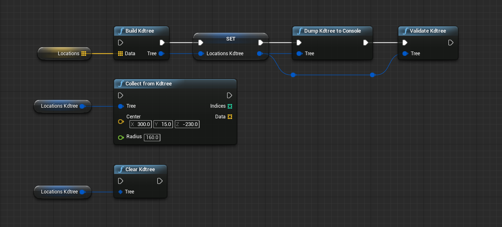
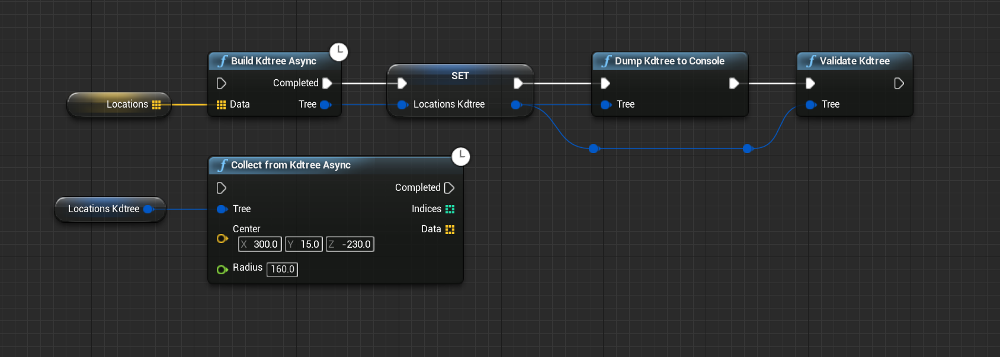

# UE4 Plugin: kd-tree

This is a UE4 plugin to provide utility functions for building kd-tree as Blueprint Function Library.

## Supported Environment

This plugin is tested on the below environment.

* UE4 Version: 4.22 
* OS: Windows/Mac

## Installation

#### 1. Download source code

Download whole project's source code from [GitHub](https://github.com/nutti/UE4-Kdtree/archive/master.zip) and unzip it.

#### 2. Move the plugin

Move the plugin folder (`Kdtree` directory) into the "Plugins" directory in your UE4 project folder.

#### 3. (re-) Generate project files

Generate project files (for example with RMouseButton on the \*.uproject) for Visual Studio (Windows) or XCode (Mac).

#### 4. Build

Build the project.

#### 5. Launch UE4 editor and enable the plugin

Launch .uproject file and enable the plugin via *Settings* > *Plugins* > *Project* > *Other* > *kd-tree*.

## Features / Tutorials

### Build kdtree and radius search

1. `Build Kdtree` builds a kd-tree (`Kdtree` object in Blueprint) from `Vector` objects.
   * `Dump Kdtree to Console` outputs the internal information of `Kdtree` object to the console for debugging.
   * `Validate Kdtree` checks the `Kdtree` object and halts the game play if there is a incorrect in it. 
2. `Collect from Kdtree` collects `Vector` objects in the sphere (center location is `Center`, radius is `Radius`). `Collect from Kdtree` also returns indicies of list that is input argument of `Build Kdtree`.
3. If you don't use `Kdtree` any more, you can destroy `Kdtree` object and free memories by `Clear Kdtree`.

### Build kdtree and radius search (Async version)

Async version is also provided by this plugin.

1. `Build Kdtree Async` is an asynchronous version of `Build Kdtree`.
   * All synchronous versions (`Collect from Kdtree`, `Dump Kdtree to Console`, `Validate Kdtree` and `Clear Kdtree`) can be applicatable to `Kdtree` object after `Build Kdtree Async` is completed.
2. `Collect from Kdtree Async` is an asynchronous version of `Collect from Kdtree`.

## Project Authors

### Owner

[**@nutti**](https://github.com/nutti)

Indie Game/Application Developer.  
Especially, I spend most time to improve Blender and Unreal Game Engine via providing the extensions.

Support via [GitHub Sponsors](https://github.com/sponsors/nutti)

* CONTACTS: [Twitter](https://twitter.com/nutti__)
* WEBSITE: [Japanese Only](https://colorful-pico.net/)

### Contributor

* [**@irvnriir**](https://github.com/irvnriir)
