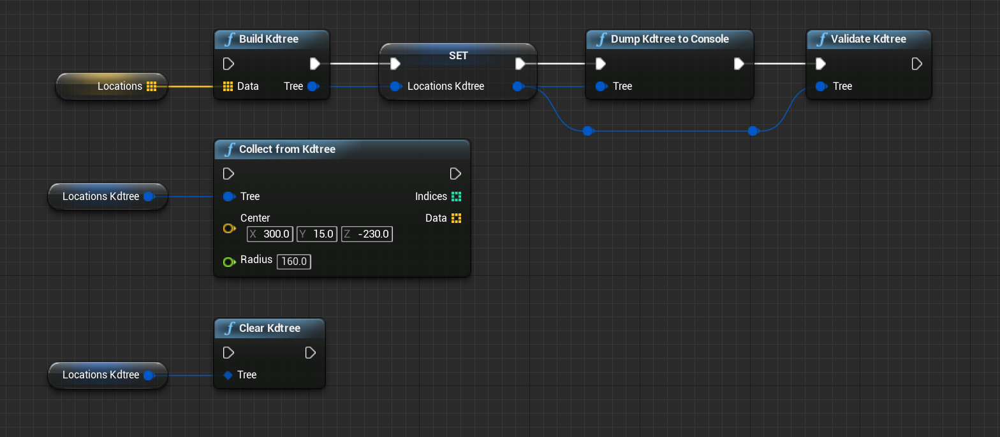

# Tutorial

## Build kd-tree and do radius search

1. `Build Kdtree` builds a kd-tree (`Kdtree` object in Blueprint) from `Vector`
   objects.
   * `Dump Kdtree to Console` outputs the internal information of `Kdtree`
     object to the console for debugging.
   * `Validate Kdtree` checks the `Kdtree` object and halts the game play if
     there is a incorrect in it.
2. `Collect from Kdtree` collects `Vector` objects in the sphere (center
   location is `Center`, radius is `Radius`). `Collect from Kdtree` also
   returns indicies of list that is input argument of `Build Kdtree`.
3. If you don't use `Kdtree` any more, you can destroy `Kdtree` object and free
   memories by `Clear Kdtree`.

## Use asynchronous version

1. `Build Kdtree Async` is an asynchronous version of `Build Kdtree`.
   * All synchronous versions (`Collect from Kdtree`, `Dump Kdtree to Console`,
     `Validate Kdtree` and `Clear Kdtree`) can be applicatable to `Kdtree`
     object after `Build Kdtree Async` is completed.
2. `Collect from Kdtree Async` is an asynchronous version of
   `Collect from Kdtree`.
